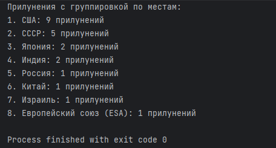
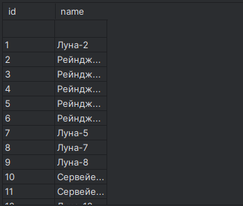

# lab15  

## Задание
    Спроектируйте БД с использованием crow’s foot notation.
    Реализуйте парсер для сбора данных с веб-страницы.
    С помощью DB API cоздайте таблицы БД и заполните их данными, полученными с помощью парсера.
    Напишите запросы для выборки данных из БД.
    Оформите отчёт в README.md. Отчёт должен содержать:
        Условия задач
        Описание проделанной работы
        Скриншоты результатов
        Ссылки на используемые материалы

## Описание проделанной работы
Сначала я сделал парсер для парсинга страницы по своему варианту (`2`), после чего использовал полученные данные для создания и заполнения таблиц, а также для написания запросов.

## Скриншоты

## Список использованных источников
[лаба](https://evil-teacher.on.fleek.co/prog_pm/term2/lab15/)   

